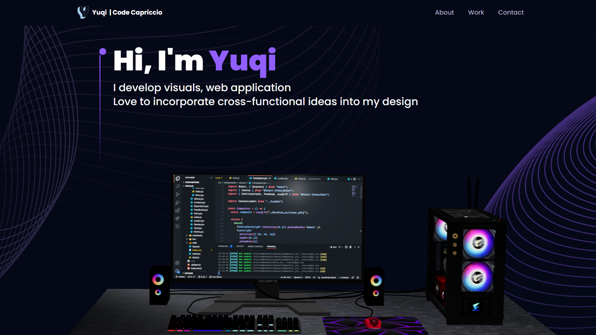

# React + Vite + ThreeJS + TailWindCSS + Framer Motion

This porfolio takes the above most recent technologies incorporated with reactJS, demenstrating an impressive website using 3D graphics and animation to bring interactive components to life.

- ThreeJS 
    - a powerful 3D graphics library for rendering and animating the 3D model
- React Three Fiber 
    - a popular library for creating 3D graphics with ThreeJS in React
- TailwindCSS 
    - a popular utility-first CSS styling framework
- Framer Motion 
    - the most popular library used to bring your React website to life with animations

- Load, develop, and customize wonderful 3D models and geometries with different lights, as well as comprehend the 3D environment with a camera and object orientation in space.
- Use Higher Order Components (HOCs) and other industry-standard best practises to make the code reusable and scalable.
- Implement email distribution via a website form.
- Using Suspense and Preload, I can ensure responsiveness across all devices while also improving site performance.

